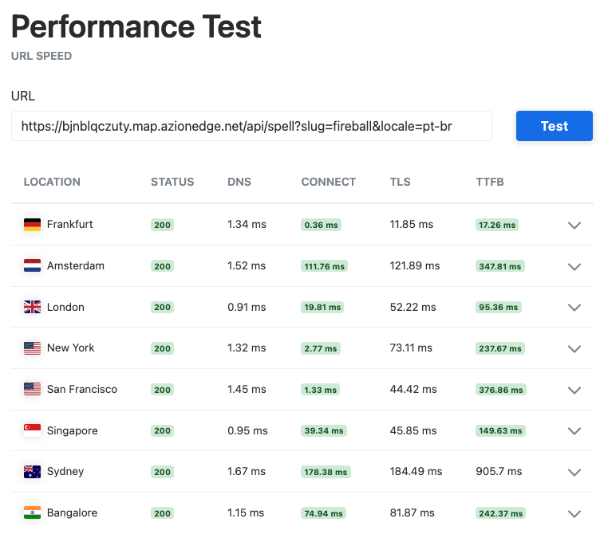

# Augmented Open5e (Open5e Aumentado)

<p align="left">
  <a href="README.md"></a>&nbsp;&nbsp;
  <a href="LEIAME.md"></a>&nbsp;&nbsp;
  <a href="LEAME.md"></a>
</p>

Uma API REST open-source (MIT) deployada no **[Azion Edge Functions](https://www.azion.com/pt-br/documentacao/produtos/build/edge-application/edge-functions/)** que atua como uma camada de "aumento" (augmentation) sobre a [API pública do Open5e](https://api.open5e.com/) para traduções automáticas via IA.

Ela serve conteúdo do System Reference Document (SRD) de Dungeons & Dragons 5ª Edição, estendendo-o automaticamente com traduções geradas por Inteligência Artificial para diferentes idiomas usando a **API do Groq** (com o modelo [llama-3.3-70b-versatile](https://console.groq.com/docs/models)).

**Demo ao vivo:** O deploy público deste fork pode ser testado em https://bjnblqczuty.map.azionedge.net/

> **Por que Groq em vez do Azion AI Inference?** Este projeto é open-source e roda em uma conta gratuita da Azion. No momento deste release, o plano gratuito não inclui acesso ao [Azion AI Inference](https://www.azion.com/pt-br/documentacao/produtos/ai/ai-inference/). Em um setup pago, o AI Inference seria uma escolha mais direta e eficiente — sem dependência de API externa. O Groq foi escolhido como alternativa prática: oferece um plano gratuito generoso com inferência rápida e excelente suporte multilingual.

> **AVISO:** Este projeto baseia-se inteiramente no SRD de D&D 5e, disponibilizado sob licença [Creative Commons Attribution 4.0 International (CC-BY 4.0)](https://creativecommons.org/licenses/by/4.0/). **As traduções fornecidas por esta API são estritamente geradas por máquina (via IA/LLMs) sob demanda e NÃO SÃO traduções oficiais.** Este projeto não é afiliado, endossado nem criado com o intuito de reproduzir as obras traduzidas protegidas por direitos autorais da Wizards of the Coast ou de qualquer um de seus parceiros locais de publicação.

## Valor Real e Caso de Uso

O principal objetivo desta API **não é** substituir a API do Open5e, mas complementá-la. Um cliente pode usar o Open5e diretamente para busca e paginação, e usar esta API apenas como uma camada de tradução rápida pelo slug.

As traduções são rápidas porque rodam no edge e são cacheadas globalmente — baixa latência garantida após o primeiro acesso. Isso inclui o conteúdo original em inglês: assim que uma magia é buscada no Open5e pela primeira vez, ela é cacheada no edge e reutilizada em todas as requisições de tradução subsequentes para aquela magia, sem chamadas repetidas à API upstream.

Essa baixa latência global pode ser verificada com ferramentas como o [KeyCDN Performance Test](https://tools.keycdn.com/performance?url=https://bjnblqczuty.map.azionedge.net/api/spell?slug=fireball&locale=pt-br):



Este projeto também não tem como objetivo substituir quaisquer traduções oficiais existentes, mas sim servir como um recurso para a comunidade e uma demonstração do que pode ser construído na plataforma Azion Edge.

**Exemplo Concreto:** Uma UI de grimório digital ou ficha de personagem que exibe magias traduzidas automaticamente. O cliente busca a magia no Open5e, extrai o slug e chama esta API para obter a tradução — sem precisar gerenciar nenhuma infraestrutura de tradução própria.

## Escopo e Decisões de Design

Esta API suporta intencionalmente apenas a busca individual de magias por slug. A API do Open5e já lida muito bem com busca e paginação — um cliente que tem o slug de uma magia pode usar esta API puramente como camada de tradução, solicitando o conteúdo para um determinado locale sem nenhuma infraestrutura adicional.

Vale mencionar também que traduções em bulk não são suportadas. O modelo de edge computing (V8 isolates com limites rígidos de tempo de execução) não foi projetado para processamento de longa duração em massa; essas operações pertencem a um cloud worker tradicional consumindo uma fila de mensagens.

## Endpoints

| Método | Caminho | Descrição |
|--------|---------|-----------|
| `GET` | `/api/spell?slug=<slug>&locale=<locale>` | Retorna uma magia traduzida para o locale solicitado |
| `GET` | `/api/spells?locale=<locale>` | Retorna todos os slugs atualmente em cache para um dado locale |

O endpoint `/api/spells` (sem slug) é voltado principalmente para uso interno e observabilidade — ele não retorna dados de magias, apenas a lista de slugs já cacheados para cada locale.

**Formato do locale:** O parâmetro de query `locale` deve sempre seguir o formato `idioma-região` (ex.: `pt-br`, `en-us`, `es-es`). Códigos simples como `pt` ou `en` são rejeitados com HTTP 400.

## Como Funciona

Cada requisição ao `GET /api/spell` segue este fluxo:

1. **Validação de entrada** — `slug` e `locale` são obrigatórios. O formato do locale também é validado. Parâmetros ausentes ou inválidos retornam `400 Bad Request`.

2. **Validação do slug** — O edge consulta um índice KV com todos os slugs de magias válidos do Open5e. Se o slug não estiver na lista, retorna `404 Not Found` imediatamente. Na primeira requisição (cold start), esse índice é buscado de forma síncrona no Open5e e então cacheado — todas as requisições seguintes utilizam a cópia local sem chamada externa.

3. **Consulta ao cache** — O edge verifica o KV Storage para o par `slug + locale`.
   - **Cache hit** → `200 OK` com a magia traduzida. Nenhuma chamada externa é feita.

4. **Cache miss** — O edge verifica se o conteúdo base em inglês (`en-us`) já está cacheado.
   - **Inglês não cacheado** → O pipeline completo é disparado em background: buscar a magia no Open5e, cachear a versão em inglês, traduzir e cachear o locale alvo. Retorna `202 Accepted` imediatamente.
   - **Inglês cacheado e locale alvo é `en-us`** → Retorna `200 OK` diretamente.
   - **Inglês cacheado e locale alvo é outro** → Apenas a etapa de tradução roda em background. Retorna `202 Accepted`.

5. **Estado pendente** — Se um job em background já está rodando para aquele `slug + locale`, a requisição retorna `202 Accepted` sem disparar um job duplicado.

6. **Polling pelo cliente** — Em `202`, o corpo da resposta contém um campo `progress` indicando o estado do job em background:
   - `"started"` — um novo job foi disparado para esta requisição.
   - `"in-progress"` — um job já estava rodando quando a requisição chegou.

   Clientes **devem usar o campo `progress`** para determinar o que exibir. O campo `message` é apenas informativo e pode mudar sem aviso prévio. Tente a mesma requisição novamente após um breve intervalo até receber `200`.

7. **Respostas de erro** — `400` para entrada inválida; `404` para slugs desconhecidos; `500` para erros inesperados como timeouts no edge, que não devem ocorrer em condições normais.

## Sugestões de Possíveis Melhorias

A arquitetura atual serve bem os resultados cacheados, mas há próximos passos naturais caso o projeto evolua:

- Um **Cloud Worker** (ex.: Cloud Run, Lambda) consumindo uma fila de mensagens para processar traduções em bulk de forma assíncrona, fora das restrições do edge.
- O endpoint `/api/spells` poderia disparar automaticamente um job de tradução em background quando um locale for solicitado pela primeira vez, tornando-o o ponto de entrada natural para aquecer o cache de um novo idioma.

## Desenvolvimento

Este projeto utiliza o [pnpm](https://pnpm.io/) como gerenciador de pacotes. Caso não esteja instalado, instale-o globalmente via `npm install -g pnpm`.

### Configuração

Instalar dependências:

```bash
pnpm install
```

Formatação e Lint:

```bash
pnpm format
pnpm lint
```

Para fazer o deploy e gerenciar este projeto também é necessário ter a [Azion CLI](https://www.azion.com/pt-br/documentacao/produtos/azion-cli/visao-geral/) instalada. Instale-a para a sua plataforma:

**macOS/Linux:**

```bash
curl -fsSL https://cli.azion.app/install.sh | bash
```

**Windows (via Winget):**

```bash
winget install aziontech.azion
```

Em seguida, autentique-se com sua conta Azion:

```bash
azion login
```

### Desenvolvimento e Testes

#### Testes Unitários

Utilizamos Vitest para os testes unitários:

```bash
pnpm test
```

Para gerar um relatório de cobertura (salvo em `coverage/` e exibido como resumo no terminal):

```bash
pnpm coverage
```

Para abrir a UI interativa de cobertura no navegador:

```bash
pnpm coverage:ui
```

#### Emulação Local e Documentação

Você pode emular o ambiente do Azion Edge Functions localmente antes de fazer o deploy.

1. **Inicie o Emulador** — em um primeiro terminal:

   ```bash
   pnpm emulate
   ```

2. **Abra o servidor local** no navegador em `http://localhost:3333`. A página inicial traz detalhes do projeto, links para a documentação interativa da API (Scalar UI) e acesso rápido para testar os endpoints diretamente.

#### Emulador Local — Observações de Comportamento

**KV Storage em disco:** Ao rodar localmente, o emulador da Azion persiste os dados de KV em `.edge/storage/<nome-do-bucket>/` na raiz do projeto. Para resetar o cache local, pare o emulador, apague os arquivos desse diretório e reinicie:

```bash
rm .edge/storage/augmented_spells_kv-staging/*
```

**Chave da API do Groq:** O emulador local chama a **API real do Groq**. Crie um arquivo `.env.local` na raiz do projeto antes de executar `pnpm emulate`:

```env
GROQ_API_KEY=sua_chave_aqui
```

Esse arquivo já está listado no `.gitignore`. Obtenha uma chave gratuita em [console.groq.com](https://console.groq.com).

### Pipeline de CI/CD (GitHub Actions)

Dois workflows estão configurados em `.github/workflows/`:

| Workflow | Arquivo | Gatilho |
|----------|---------|---------|
| **CI** | `ci.yml` | Todo push (qualquer branch) e PRs com destino a `main` |
| **Deploy** | `deploy.yml` | Após o CI passar na `main` |

O workflow de **CI** executa os testes unitários (`pnpm test`) e em seguida verifica se a cobertura atinge o threshold mínimo de **90%** em statements, branches, functions e lines (`pnpm coverage`). Se qualquer um dos dois falhar, o CI falha e o deploy é bloqueado.

O workflow de **Deploy** utiliza `workflow_run` para disparar apenas após o workflow de CI concluir **com sucesso** na `main`. Isso garante que nenhum código chega à produção sem passar nos testes e na verificação de cobertura. Pushes diretos na `main` sem o CI ter passado não acionam o deploy.

### Estratégia de Deploy

Este projeto usa uma configuração de duplo-ambiente (Staging e Produção) definida em `azion.config.ts`. Os recursos criados na Azion recebem automaticamente o sufixo `-staging` ou `-prod`.

Os arquivos de estado `azion.json` (em `azion/staging/` e `azion/production/`) **são commitados no repositório** para garantir a consistência do deploy entre diferentes ambientes e pipelines de CI/CD.

#### 1. Configuração para Novos Colaboradores

Após clonar o repositório, execute o comando de reset para gerar os arquivos `azion.json` iniciais para sua própria conta Azion:

```bash
pnpm reset
```

Seu primeiro `pnpm deploy` criará os recursos e atualizará esses arquivos com os novos IDs.

#### 2. Deploy de Staging

```bash
pnpm deploy:staging
```

Faz o build e o deploy no namespace `augmentedopen5e-staging`. Na primeira execução, o CLI cria os recursos; nas subsequentes, os atualiza usando os IDs commitados.

#### 3. Deploy de Produção

```bash
pnpm deploy:prod
```

Faz o build e o deploy no namespace `augmentedopen5e-prod`. **Observação:** Na maioria dos casos, isso é feito automaticamente pelo GitHub Actions a cada push na branch `main` — o deploy manual de produção geralmente não é necessário.

#### 4. Limpeza do Cache Remoto

```bash
pnpm delete:cache:staging
pnpm delete:cache:prod
```

Utiliza o Azion CLI para listar e apagar todos os objetos do bucket correspondente. Útil para invalidar traduções em cache que estejam desatualizadas.

### Fazendo Fork deste Projeto

Se você fizer um fork deste repositório, siga estes passos antes do seu primeiro deploy:

1. Obtenha sua própria chave da API do Groq em [console.groq.com](https://console.groq.com). Adicione-a como `GROQ_API_KEY` em:
   - Um arquivo `.env.local` na raiz do projeto (para emulação local).
   - As variáveis de ambiente da sua Edge Function na Azion (Azion Console → Edge Functions → sua função → Environment Variables).
2. Execute `pnpm reset` para gerar novos arquivos `azion.json` iniciais. Sem este passo, o CLI tentará atualizar recursos que não existem na sua conta e falhará.
3. Após o primeiro deploy bem-sucedido, **commite os arquivos `azion.json` atualizados**. Esses arquivos passam a conter os IDs dos recursos Azion recém-criados. Sem commitá-los, deploys futuros podem falhar com erro de conflito de recursos.

## Licença

O código-fonte é licenciado sob a **Licença MIT**.

O conteúdo servido por esta API (incluindo as traduções geradas por IA) é derivado do SRD da 5ª Edição e é licenciado sob **Creative Commons Attribution 4.0 International (CC-BY 4.0)**, acompanhando a licença da API do Open5e.

---

*Criado com carinho e cuidado por Luiz Carlos Vieira para toda a comunidade.* ❤️
